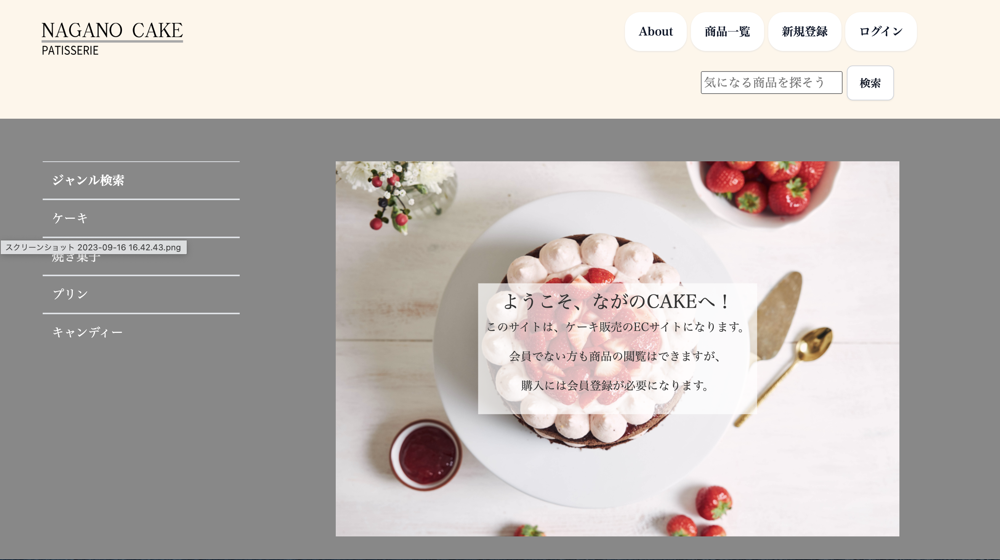

# ながのCAKE ECサイト

# 概要
このECサイトはDMM WEB CAMP生（チーム：YSKH4)によるチーム開発課題です。
長野県にある小さな洋菓子店、「ながのCAKE」の商品を通販するためのECサイト開発です。
実在する店舗ではありませんので、参考までにご覧ください。

# 案件の背景
元々近隣住民が顧客だったが、昨年始めたInstagramから人気となり、全国から注文が来るようになった。
InstagramのDMやメールで通販の注文を受けていたが、情報管理が煩雑になってきたため、
管理機能を含んだ通販サイトを開設することになった。

# 言語とフレームワークのバージョン
* Ruby 3.1.2
* Rails 6.1.7.6
* Bootstrap v4.5
* Fontawesome v5.15.4

# 使用したGem
* gem 'devise' 
* gem 'kaminari','~> 1.2.1'
* gem "enum_help"
* gem 'image_processing', '~>1.2'
* gem "byebug"

# 実装機能

## 管理者側
* 管理者ログイン、ログアウト
* 商品の新規追加、編集、閲覧、販売停止中
* 商品ジャンルの追加、編集
* 会員登録されているユーザー情報の閲覧、編集、退会処理
* 全てのユーザーの注文履歴閲覧
* ユーザーごとの注文履歴閲覧
* 注文・製造ステータス変更

## 顧客（会員側)
* 会員新規登録、ログイン、ログアウト、退会
* 会員情報の編集
* 配送先の登録、編集、削除
* カートへの追加、商品購入
* 支払い方法、配送先の指定
* 注文履歴の閲覧
* ジャンル検索機能
 
## その他
* 商品検索機能

# 使用方法
* $ git clone git@github.com:YSKH4/NaganoCake.git
* $ cd NaganoCake
* $ rails db:migrate
* $ rails db:seed
* $ yarn install
* $ bundle install
* $ yarn add @babel/plugin-proposal-private-methods @babel/plugin-proposal-private-property-in-object
* $ rails s

## 顧客（会員)ページのログイン方法
* 新規登録ボタンから新規登録し、ログインしてください。

## 管理者ページのログイン方法（admin/sign_in)
* URLの.comの後に /admin/sign_in を入力してください。
* 管理者ページのログインに必要なメールアドレス及びパスワードは下記の通りです。

 メールアドレス：test@test

 パスワード: testtest
  
# 設計書
* [ER図](https://app.diagrams.net/#G1BcuLXrxmRUWk0jXYlD_FyZxeginh5_rC)
* [テーブル定義書](https://docs.google.com/spreadsheets/d/1cUkMvTcVo7CoMprHMt5LzshVnVW4mBuG/edit#gid=22058163)
* [アプリケーション詳細設計書](https://docs.google.com/spreadsheets/d/1CKnzg6rlqMtyDpPtzL2f_tLxDyNc4zM1KeAhHwzMYLk/edit#gid=549108681)
* [WBS(yskh4)](https://docs.google.com/spreadsheets/d/197HucfrXNNp9yEQ5aQ1PS-3gnQjLBJpkry8YHWKglh4/edit#gid=1026018223)

# 作成者アカウント

個人Githubへのリンク
* [さやねえ](https://github.com/sayakamik)
* [ゆりりん](https://github.com/yurinonaito)
* [ダンボ](https://github.com/Hiroki-516)
* [ハルト](https://github.com/Hiroki-516)

